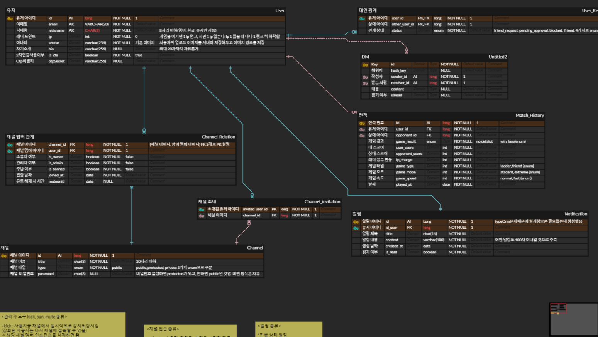

#  transcendence 

- 🧇[**transcendence**](https://d1vexdz72u651e.cloudfront.net/)는 42seoul 공통과정의 마지막 프로젝트입니다.
- 실시간 pingpong게임과 DM, 그룹채팅을 지원하는 웹어플리케이션입니다.

- 개발 기간 : 23.09.16 ~ 24.12.20 (약 3개월)

- 본 레포는 **BACKEND** 개발에 관한 내용을 위주로 설명합니다.

- FRONTEND 개발에 관해 궁금하시다면? [ft-transcendence-seoul](https://github.com/ft-transcendence-seoul/frontend)
    

## 🏷️ 목차

#### 1. [배포 💻](#💻-배포)

#### 2. [개발팀 & 역할 분담 🙋‍♂️](#🙋‍♂️-개발팀--역할-분담)

#### 3. [Stacks 🔧](#🔧-stacks)

#### 4. [주요 API & 소켓 명세📃](#📃-주요 API & 소켓 명세)

#### 5. [erd 설계 📱](#📱)

#### 6. [기능 소개 🚀](#🚀-기능 소개 )

## 💻 배포

사이트 url:  https://develop.d35lpok7005dz1.amplifyapp.com/

## 🙋‍♂️ 개발팀 & 역할 분담

|                                                                                             |                                                                                    |                                                                                              |
| :-----------------------------------------------------------------------------------------: | :--------------------------------------------------------------------------------: | :------------------------------------------------------------------------------------------: |
|                                           eunjilee                                            |                                       seonyun                                       |                                            woojeong                                            |
|                     [@ohsuhyeon0119](https://github.com/ohsuhyeon0119)                      |                    [@ComPhyPark](https://github.com/ComPhyPark)                    |                            [@izone00](https://github.com/izone00)                            |
| erd설계 / 인증(OAuth2, QR코드) / 유저 , 친구, 차단 API| 채널 관련 기능 API | DM, 채널 메세지, 게임, 알림 실시간 소켓 / 배포  |

## 🔧 Stacks

#### 기술 스택

 &nbsp; &nbsp; &nbsp;
 &nbsp; &nbsp; &nbsp; 
 &nbsp; &nbsp; &nbsp; 
 &nbsp; &nbsp; &nbsp;
 &nbsp; &nbsp; &nbsp; 
 &nbsp; &nbsp; &nbsp; 
  

#### 협업

 &nbsp; &nbsp; &nbsp;
 &nbsp; &nbsp; &nbsp;

  

## 📃 주요 API & 소켓 명세                                |
[API 엔드포인트 및 웹소켓 명세 ](https://magnificent-front-23e.notion.site/074867d3c81548358f6f66c1892f50a9?v=7e96fea9c48e4e52bf8270af0597a88f)

## 📱 erd 설계

  

## 🚀 기능 소개

- 🎥 42API의 **OAUTH2.0**을 통한 로그인을 지원하고 qr코드를 통한 authencation **2차 인증**을 제공합니다.

- 👑 각 유저들은 친구나 차단 등의 관계를 가질수 있고 친구끼리는 서로 **DM**이 가능합니다.

- 📊 채널을 생성하고 채널에 참가해 여러명의 유저와 **그룹 채팅**을 할 수 있습니다.
- ⭐ 실시간으로 자신의 게임 rating에 따른 **게임 매칭**이 가능합니다. 
- ✅ 웹소켓을 통해 **실시간으로 pingpong경기**를 할 수 있습니다. 
- 📚 다른 유저 **online 상태를 확인**할 수 있고 **전적과 랭크 rating 조회** 가능
- 👍 게임 매칭과 친구 초대, 메세지와 같은 기능을 **실시간 알림**으로 제공합니다.
